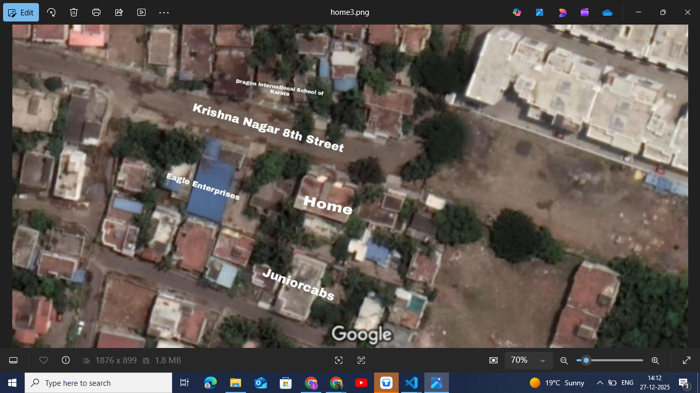

# Ex04 Places Around Me
# Date:
# AIM
To develop a website to display details about the places around my house.

# DESIGN STEPS
## STEP 1
Create a Django admin interface.

## STEP 2
Download your city map from Google.

## STEP 3
Using <map> tag name the map.

## STEP 4
Create clickable regions in the image using <area> tag.

## STEP 5
Write HTML programs for all the regions identified.

## STEP 6
Execute the programs and publish them.

# CODE:
'''
<!DOCTYPE html>
<html lang="en">
<head>
<title>My Home</title>
</head>
<body>
    

        <h1>My Home</h1>
    
    

</body>
</html>

<!DOCTYPE html>
<html lang="en">
<head>
<title>My Area</title>
</head>
<body>
    
        

        
        <map name="MyArea">
        <area shape="rect" coords="411,183,786,312" href="krishna_nagar.html"  title="Krishna Nagar 8th Street">
        <area shape="rect" coords="679,388,815,469" href="house.html"  title="Home">
        <area shape="rect" coords="359,344,555,432" href="eagle.html"  title="Eagle Enterprises">
        <area shape="rect" coords="515,114,762,175" href="dragon1.html"  title="Dragon International School of Karate">
        <area shape="rect" coords="589,564,775,671" href="junior_cabs.html"  title="Juniorcabs">
        
        </map>
        

        
</body>
<!DOCTYPE html>
<html lang="en">
<head>
<title>Juniorcabs</title>
</head>
<body>
    

        <h1>Juniorcabs</h1>
    
    

</body>
</html>
<!DOCTYPE html>
<html lang="en">
<head>
<title>Krishna Nagar 8th Street</title>
</head>
<body>
    

        <h1>Krishna Nagar 8th Street</h1>
        
    

    

</body>
</html>

<!DOCTYPE html>
<html lang="en">
<head>
<title>Dragon International School of Karate</title>
</head>
<body>
    

        <h1>Dragon International School of Karate</h1>
    
    

</body>
</html>
<!DOCTYPE html>
<html lang="en">
<head>
<title>Eagle Enterprises</title>
</head>
<body>
    

        <h1>Eagle Enterprises</h1>
    
    

</body>
</html>
# OUTPUT:
# RESULT
The program for implementing image maps using HTML is executed successfully.
